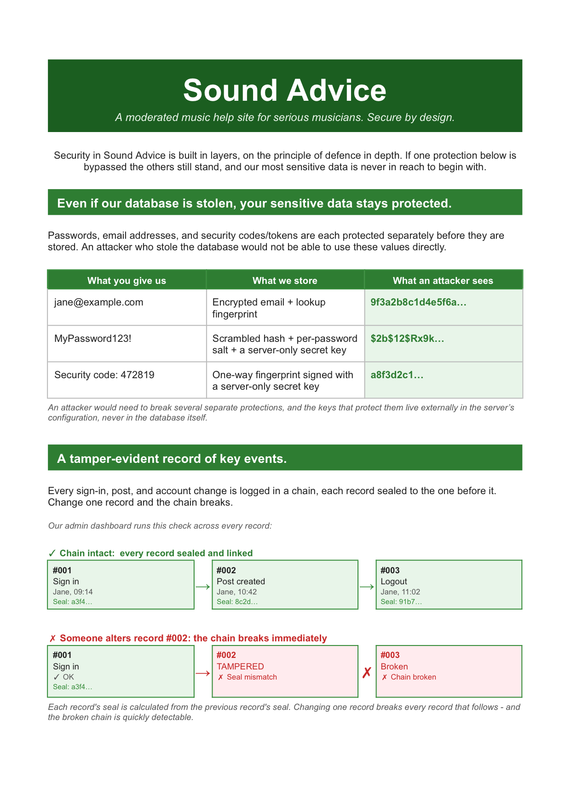
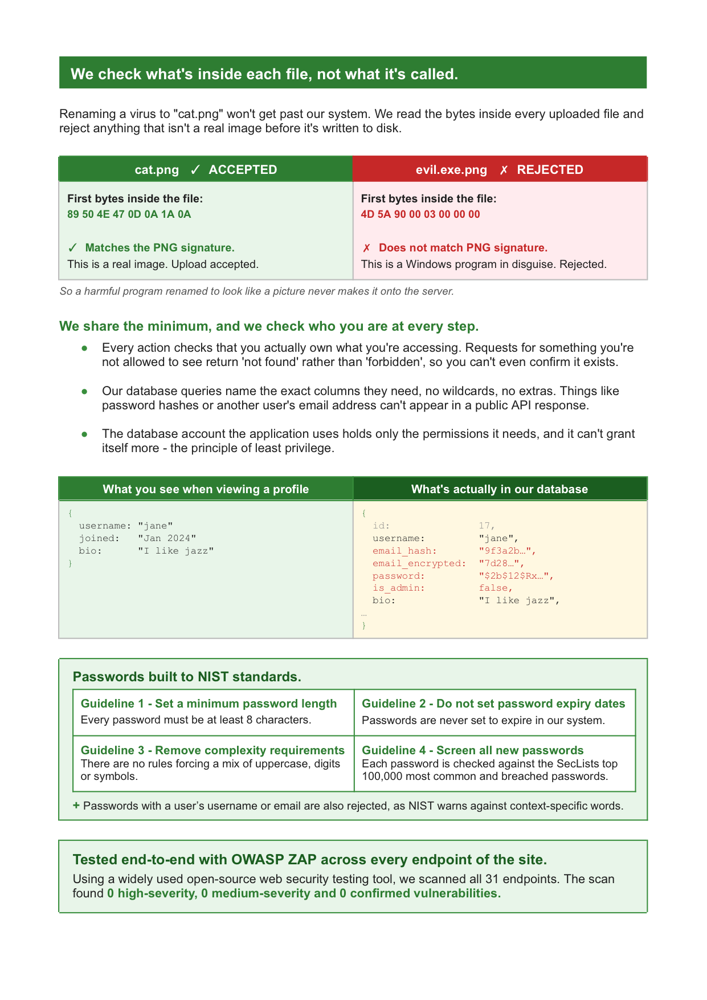
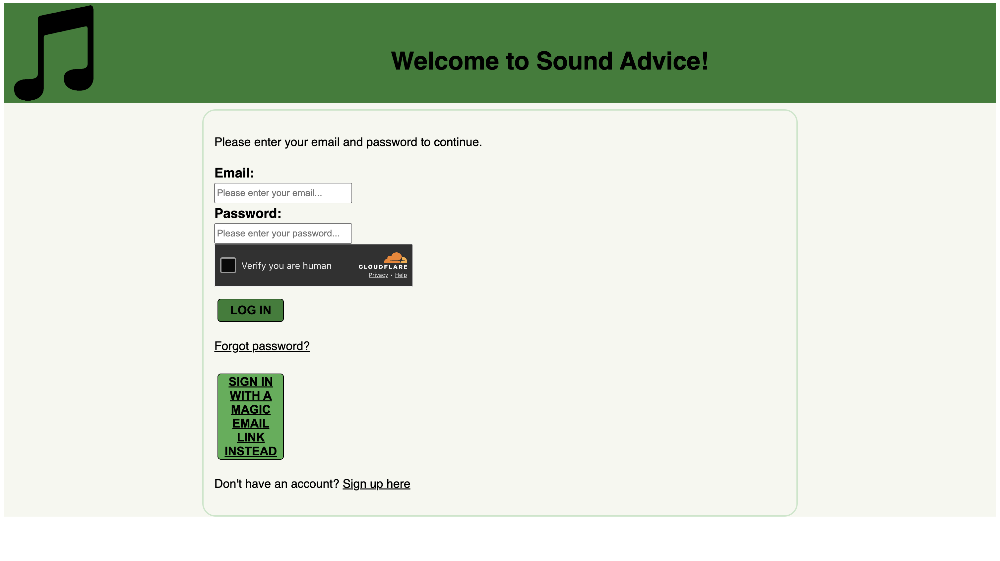
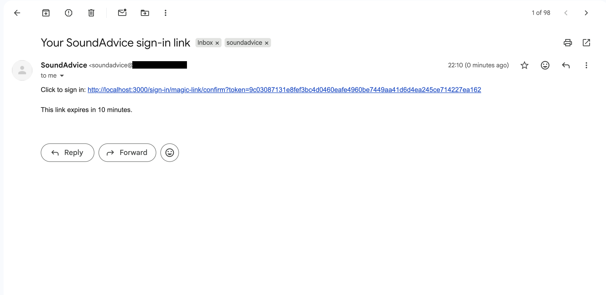
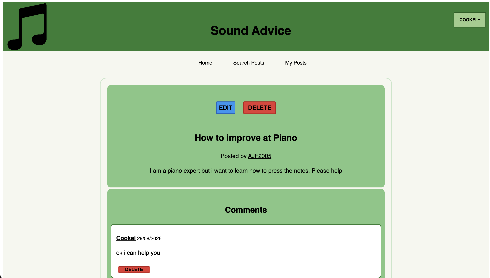
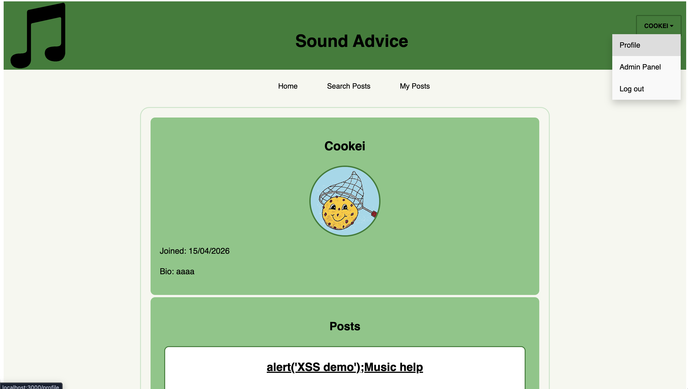
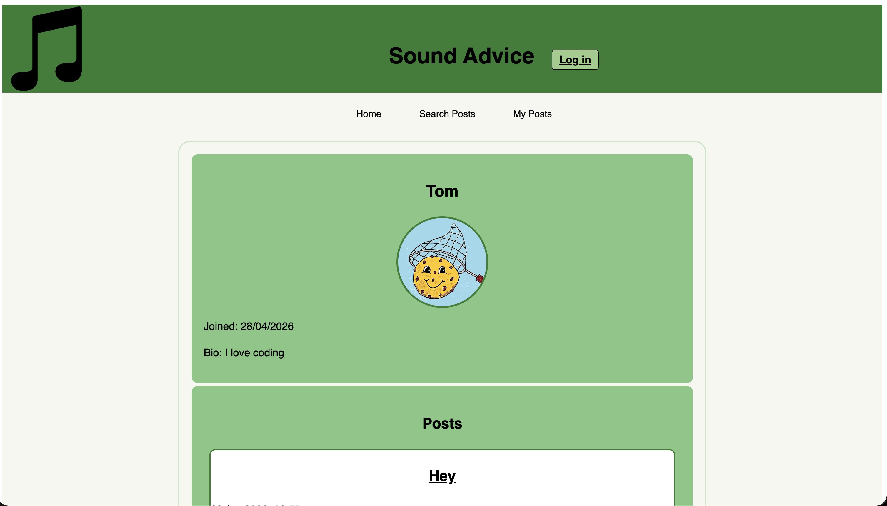
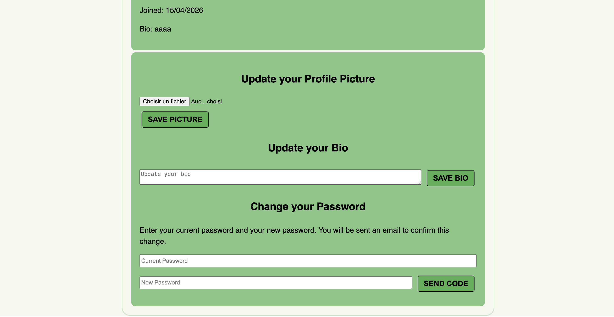
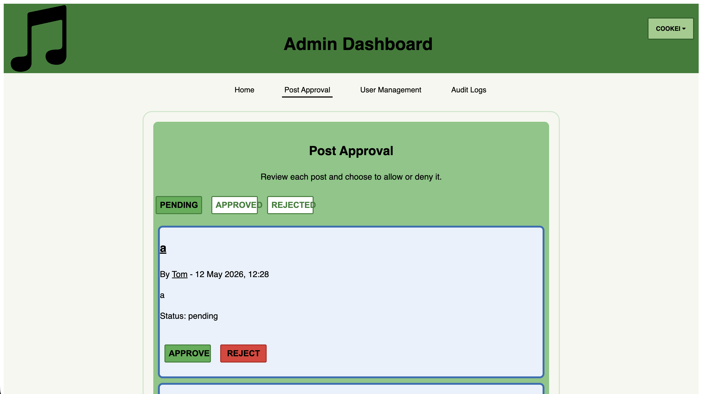
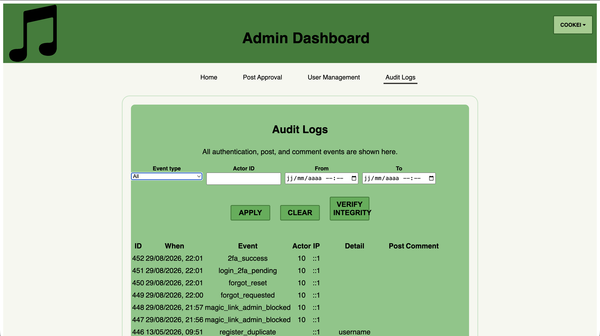

<div align="center">

# SoundAdvice

**Every security control in this application is hand-written.**


[](flyer.pdf)
[](#screenshots)
[](#how-this-was-tested)

<a href="flyer.pdf"></a>
<a href="flyer.pdf"></a>

</div>

The app is a music advice forum where users help each other improve. Anyone can
post a question, and an admin approves it before it goes public so the quality
stays high. The forum itself isn't really the point: it needs accounts, roles,
sessions, user-submitted HTML and file uploads, which makes it a realistic thing
to attack.

The whole thing runs on four packages: express, pg, bcrypt and dotenv. That's the
entire dependency list and it's deliberate. Sessions, CSRF tokens, the HTML
sanitiser, the multipart file parser, rate limiting, password screening,
encrypted email storage with a searchable lookup index, and a hash-chained
audit log are all built on Node's standard library. The same goes for the rest
of the stack: migrations are numbered .sql files applied in order, and there's
no ORM, no template engine and no build step.

In a real product most of this would come from a library. The point here was to
build each control and then try to break it, which is hard to do properly when
the mechanism is hidden behind someone else's API.

Two exceptions, both on purpose: bcrypt for password hashing and Node's crypto
for primitives. Writing your own AES is a bad idea.

Built by a team of three. The work went into the backend and the threat model,
not the interface.

## Table of contents

**The project tour**: [Screenshots](#screenshots) · [Flyer](#flyer) · [Technology](#technology) · [Structure](#structure)

**The security work**: [Features](#features) · [How this was tested](#how-this-was-tested) · [Core vulnerabilities mitigated](#core-security-vulnerabilities-mitigated): [account enumeration](#account-enumeration), [session hijacking](#session-hijacking), [SQL injection](#sql-injection), [XSS](#cross-site-scripting), [CSRF](#cross-site-request-forgery)

**Running the project**: [Setup](#setup) · [Scripts](#scripts) · [Database migrations](#database-migrations) · [Deployment notes](#deployment-notes)

**Reference**: [Pages](#pages) · [API](#api) · [License](#license)

## Screenshots

The UI is deliberately plain and these are not trying to look good. They are here
to show the controls described below sitting on a working app: Turnstile on the
login form, the moderation queue, the audit log viewer and the rest.

<details>
<summary>Eight screens from the app</summary>



**Sign in**: Email and password behind a Cloudflare Turnstile check, with the magic-link option and the forgot-password flow below it



**Magic-link email**: The one-time link as it arrives, sent through Resend, good for 10 minutes



**A post and its comments**: An approved post with its comment thread. Edit and delete are showing because the signed-in user is an admin



**Public profile, signed in**: That post title is literally `alert('XSS demo');`. The sanitiser stored it as text and the page renders it as text



**Public profile, signed out**: The same page as a guest. The endpoint behind it never returns an email or the admin flag



**Account settings**: Profile picture, bio, and a password change that needs the current password and an emailed code



**Moderation queue**: Pending posts waiting on an admin, filterable by pending, approved or rejected



**Audit log**: Typed events with filters, and the Verify Integrity button that walks the hash chain

</details>

## Flyer

[`flyer.pdf`](flyer.pdf) is a two-page flyer that explains a selection of SoundAdvice's
security measures to a non-technical reader: encryption at rest, the
tamper-evident audit log, magic-byte file checks, least privilege and NIST
password guidelines. It also includes the OWASP ZAP result: all 31 endpoints
scanned, with 0 high-severity, 0 medium-severity and 0 confirmed
vulnerabilities. Those numbers came from a single baseline scan at the time, not
a guarantee about the current commit.

## Technology

Built with Node.js, Express and PostgreSQL on the server.

The frontend is as simple as possible: plain HTML, CSS and JavaScript.

Four dependencies: express, pg, bcrypt and dotenv. Tests run on Mocha
and Chai, with Prettier for formatting and pnpm for package management.

Two external services: Cloudflare Turnstile for bot protection on the login and
registration forms, and Resend for transactional email (2FA codes, magic links,
password resets). Font Awesome is loaded from cdnjs with an SRI hash pinned.

## Structure

```
app/
  public/         # client-side html, css, js, images
  server/
    routes/       # route definitions and middleware chains
    controllers/  # request handling, validation, orchestration
    queries/      # every SQL statement in the project lives here
    middleware/   # sessions, CSRF, origin checks, auth guards, headers, rate limiting
    lib/          # crypto, sanitiser, multipart parser, validation, audit log, email
    data/         # common password list used for password screening
db/               # numbered SQL migrations, applied in order
test/             # unit tests, mirroring the app/ structure
attacker-app/     # separate origin used to verify CSRF and cross-origin defences

logs/             # created at runtime; mirrors the audit_log db table as a second source of truth
uploads/          # created at runtime; user profile pictures and post images
```

## Features

The five classic web vulnerabilities have their own section at [Core security vulnerabilities mitigated](#core-security-vulnerabilities-mitigated). This covers
everything else.

### The app

- Posts with optional images, comments, and search across titles and content
- Public user profiles with a bio, profile picture and the user's approved posts
- Moderation queue: new posts stay pending until an admin approves or rejects them
- Authors can see their own pending and rejected posts, with distinct styling for each

### Usability

- Show error messages: failed client-side validation, and rate limiting
- Show loading state: disable buttons and change text to loading so users are never left waiting
- Middleware redirection: if not signed in, sent to sign in; if signed in, redirected from auth pages
- Show success messages: show useful messages even after being redirected across pages, for example after signing in
- Pending post flow: clear note when creating or editing posts that they will go into a pending process, and visually distinct UI for pending and rejected posts
- Different colour buttons for different actions, e.g. edit/delete post

### Authentication flows

- Email 2FA on admin accounts: 6-digit code, 10 minute expiry, 3 attempts before you start over
- Passwordless magic-link login, deliberately blocked for admins since it skips 2FA
- Forgot password in three steps: request a code, verify it, then reset with a short-lived token
- Changing your password needs the current password _and_ an emailed code
- A password change logs out every other session but keeps the current one alive

### Password handling

- bcrypt at cost 12, with a server-side pepper from the environment
- New passwords screened against the SecLists top 100k common passwords
- Passwords containing the user's own username or email are rejected, following NIST guidance
- Length is the only composition rule, also per NIST

### Data at rest

- Email addresses encrypted with AES-256-GCM, fresh IV per record
- Lookups still work through an HMAC blind index, keyed with a separate key derived from the encryption key
- 2FA codes, magic-link tokens and reset tokens stored as HMACs, so none of them are usable out of a database dump
- Admin user list shows masked emails, and the public profile endpoint never returns an email or admin flag

### Tamper-evident audit log

- 26 typed events across auth, posts and comments, with the enum mirrored in Postgres
- Each row is SHA-256 hashed together with the previous row's hash, so editing one row breaks every row after it
- Each hash is also HMAC'd with a server secret, so an attacker can't just recompute the chain
- Writes go through a promise queue so concurrent requests can't fork the chain
- Row-level security lets the app role INSERT and SELECT, but never UPDATE or DELETE
- Mirrored to `logs/audit.jsonl` as a second source of truth
- Admins can verify the whole chain from the UI and get back the first row that fails, and why

### Abuse prevention

- Reusable rate limiter with independent budgets per route, all per 10 minutes: 3 on the forgot-password and magic-link requests, 5 on login and registration, 10 on post creation, 15 on comment creation, 20 on edits and deletes
- Going over blocks that IP for 10 to 15 minutes depending on the route.
- Cloudflare Turnstile on login and registration, verified server-side, with a clean 503 if Cloudflare is unreachable
- `trust proxy` set in production so limits key off the real client IP rather than the proxy's

### File uploads

- Multipart parser written from scratch, no `multer`
- File type comes from magic bytes (PNG signature, JPEG `FFD8`), not the extension or the client's Content-Type
- 5MB cap enforced while streaming, and the connection is destroyed the moment it's exceeded
- Filenames are generated server-side, so a malicious name can't escape the uploads directory
- Replacing an image deletes the file it replaced

### Access control

- Separate guards for pages and API routes, so pages redirect and APIs return 401
- Admin status is re-read from the database on every request, never carried in the session
- Pending and rejected posts are visible only to their author or an admin
- Ownership checked on every edit and delete, with an admin override
- Direct access to `/html` is blocked, so pages are only reachable through their guarded routes

### Subresource integrity

- SHA-384 hashes for the site's own scripts, computed at startup and injected into the `<script>` tags as pages are served
- The browser refuses to run a script whose bytes don't match, so tampering with a JS file on disk or in transit gets blocked
- Recomputed per request in development so editing a file doesn't break the page

### Input validation

- Every controller validates before anything reaches a query, with typed validators that throw and return a 400
- Whitelist regexes rather than blacklists: usernames are `[A-Za-z0-9_]`, codes are exact-length digit strings
- Every string field has a bounded maximum length
- Integer parsing rejects decimals, negatives, and anything past `MAX_SAFE_INTEGER`

### Security headers

- `X-Frame-Options: DENY` and CSP `frame-ancestors 'none'` block clickjacking
- `base-uri 'self'` stops a `<base>` tag hijacking every relative URL on the page
- `form-action 'self'` means forms can only submit back to us
- `object-src 'none'` kills the legacy plugin attack surface
- `Referrer-Policy: strict-origin-when-cross-origin` keeps full URLs from leaking off-site
- `Cache-Control: no-store` so a logged-out user can't hit back and see a stale authenticated page

## How this was tested

Each of the five vulnerabilities below has its own evidence: a behavioural test
suite, a manual check you can reproduce against the running app, or both.

**Account enumeration** is shown manually: register with an email that is
already taken and the success message, and the time it takes to arrive, are
identical to a fresh registration. The forgot-password and magic-link forms
respond the same way whether or not the account exists. The audit log still
records the duplicate attempt, so an admin can see what really happened while
the response gives nothing away.

**Session hijacking** is easy to check from the browser: devtools shows the
session cookie carrying `HttpOnly` and `SameSite=Strict` (plus `Secure` in
production), and `document.cookie` in the console comes back empty. Revocation
is quick to check too: log out, replay the old cookie value, and it's dead,
because sessions are destroyed server-side rather than just cleared from the
browser. The two practical ways to steal a session, XSS and CSRF, have their
own coverage below.

**SQL injection** is covered in layers: every statement lives in
`app/server/queries/`, a static check fails if any of them interpolates input
into SQL, and the controller unit tests assert that malformed input gets a 400
before any query runs. Or just try it: `' OR 1=1 --` in the search box is
handled as literal text and matches nothing.

**Cross-site scripting** has the strongest automated coverage: the sanitiser
has a behavioural suite in `test/server/lib/sanitize.test.js` that checks it
tag by tag: whitelisted tags survive, everything else is stripped, event
handlers and `javascript:` URLs are removed. The profile screenshot in
[Screenshots](#screenshots) shows the end result: a post titled
`alert('XSS demo');` rendered as harmless text. The CSP backstop has its own
entry in the table below.

**Cross-site request forgery** is attacked for real. `attacker-app/` serves a
page on a separate origin that fires the actual attacks at the running app: a
`fetch` of `/api/auth/me` to try to read the CSRF token, a `POST` to
`/api/users/bio` with the victim's cookie, and a forged login as both JSON and
a plain HTML form. Every one fails, and the page shows how.

Beyond the five, 59 unit tests in all (`pnpm test`) cover password screening,
rate-limit budgets, and ownership and validation on every post and comment
route.

The five above get full write-ups because their evidence comes from several
sources. Other controls we tested:

| Control                      | How to see it hold                                                                                                                                                    |
| ---------------------------- | --------------------------------------------------------------------------------------------------------------------------------------------------------------------- |
| CSP blocks inline script     | Uncomment the `alert('1')` script in `app/public/html/index.html` and load the page                                                                                   |
| Audit log is append-only     | Uncomment the `testRowLevelSecurity(1)` call in `app/server/queries/audit.js`; Postgres rejects both the UPDATE and the DELETE                                        |
| Hash chain is tamper-evident | Edit an audit row directly in the database, then verify the chain from `/admin/logs`; it names the first row that fails, and why                                      |
| SRI catches modified scripts | Change a byte of any file in `app/public/js` with `NODE_ENV=production`; the browser refuses to run it                                                                |
| Uploads check magic bytes    | Rename any non-image file to `.png` and upload it as a profile picture; the parser reads the file's bytes, not its name, and rejects it                               |
| Rate limiting in the UI      | Swap in the reduced-budget limiter marked `FOR DEMO` on the login route in `app/server/routes/auth.js`, then fail three sign-ins; the UI shows the rate-limit message |

The OWASP ZAP baseline scan result is in the [Flyer](#flyer) section.

## Core security vulnerabilities mitigated

### Account enumeration

The register, login, forgot password request, forgot password verify, and magic link request endpoints could all be used to check for existence of an account.

This is mitigated by:

1. Generic response messages on success and failure
2. Constant time responses: fake bcrypt compare, remove email delay, and a minimum function response time

### Session hijacking

Session cookies could be stolen, guessed, or fixated and used to impersonate a logged-in user.

This is mitigated by:

1. Long, complex 256 bit random session IDs using crypto.randomBytes, which are not practical to brute force
2. Server side session storage so we can instantly revoke on logout, password change, or password reset
3. Session expiries: 1 day admin (short as admins privileged), 1 week user, 10 min pending 2FA
4. Session regenerated after 2FA to prevent fixation of attacker using a known session ID
5. Secure cookie flag forces the session cookie to only be sent over HTTPS in production, which blocks network sniffing as HTTPS encrypts all traffic including the cookie itself
6. XSS and CSRF can also lead to session hijacking, which we have protected against

### SQL injection

Attacker input could be interpreted as SQL commands, letting them read, change, or delete data they shouldn't be able to.

This is mitigated by:

1. Every database call uses a parameterised query with placeholders and values passed as a separate array, so user input is never parsed as SQL.
2. Strong server-side validation in every controller before each query, so only expected inputs reach the database query.
3. We use a least-privileged database role that is not a superuser and does not bypass RLS.

To help identify and mitigate SQL injection, all SQL statements are clearly located in the app/server/queries/ directory.

### Cross-site scripting

Cross-site scripting is when an attacker gets their JavaScript onto one of our pages so it runs in another user's browser. That script can then modify the DOM, read what's on the page, steal session data, or perform actions as the user.

This is mitigated by:

1. User content goes through a whitelist sanitiser that keeps a few safe tags, strips everything else
2. Strict input validation in every controller before anything is saved
3. The frontend builds the DOM with textContent and createElement rather than
   innerHTML, so user data is shown as plain text instead of being parsed as HTML.
   The post body is the one exception, rendering the tags the sanitiser allows
4. Content Security Policy with script-src limited to 'self' and the Turnstile widget blocks inline and any other remote scripts even if something did get onto a page
5. X-Content-Type-Options: nosniff stops the browser running an image or text file as a script
6. The session cookie is HttpOnly so a script can't read it

### Cross-site request forgery

Cross-site request forgery is when a malicious site tricks a logged-in user's browser into making a request to our site using their session cookie, causing an action they did not intend.

This is mitigated by:

1. SameSite=Strict on the session cookie, so the browser never sends it on a cross-site request
2. No CORS headers anywhere, so browsers block other sites from reading our responses by default
3. Cross-Origin-Resource-Policy is same-origin on /api/auth/me, so other sites can't embed this and grab the CSRF token
4. CSRF token on every state-changing request needs an `x-csrf-token` header. This is an HMAC of the session id so expires when session does
5. Sensitive actions recheck identity: changing the password needs the current password and an emailed code, so a forged request on its own won't work
6. Origin header check: every state-changing request is rejected if the origin is missing or doesn't match our host. This runs alongside the token check above, and is the only check available on guest routes (login, register, 2FA, forgot password, magic link), where there's no session yet to derive a token from

## Setup

Requires Node.js 18 or newer, a PostgreSQL database, and pnpm, plus a Resend API key and Cloudflare Turnstile keys (both free to sign up for). You will also need openssl,
or any other way to generate random hex strings, for the secrets in `.env`.

**1. Install dependencies**

If you do not have pnpm installed yet, follow the [pnpm installation guide](https://pnpm.io/installation).

```bash
pnpm install
```

**2. Create the database and apply migrations**

Edit `db/10_non_privileged_user.sql` first to set your role name and a strong
password. Run the migrations as a superuser in your PostgreSQL database. Migration 10 creates the non-privileged role the app itself will run as.

```bash
createdb soundadvice
for f in db/*.sql; do psql -d soundadvice -f "$f"; done
```

**3. Set up environment variables**

Copy `.env.example` to `.env` and fill in with your credentials. All variables have been commented to help you with setup.

`DATABASE_URL` must point at the non-privileged role from migration
10, not your superuser account. The audit log's tamper protections rely on the
app running without RLS bypass. On startup the app queries its own role and
**refuses to start** if it connected as a superuser or as a role with RLS bypass.

**4. Run the development server**

```
pnpm run dev
```

The app will now be accessible at: http://localhost:3000

**5. Create an admin user**

Register through the app, then promote yourself directly in the database:

```sql
UPDATE users SET is_admin = TRUE WHERE username = 'your_username';
```

There is deliberately no way to grant admin from inside the app.

At least one admin is required or no post can ever be approved.

Note that admin accounts require email 2FA on every login, so make sure your
Resend key works before promoting your account.

**6. Optional: run the attacker app**

`node attacker-app/server.js` serves a page on http://localhost:4000
that can probe the running app's CSRF and cross-origin defences.

### Scripts

```bash
pnpm dev      # start dev server with reloading
pnpm test     # runs all unit tests
pnpm format   # format all files with prettier
pnpm start    # start production server
```

### Database migrations

To make and keep track of changes to the database, create a new SQL file in the db/ directory, incrementing the numbered prefix in the filename. E.g. 01_init.sql, 02_add_phone_to_users.sql. The file can then be run to update the database.

### Deployment notes

- Set `NODE_ENV=production`. It gates the Secure cookie flag, `trust proxy` for real client IPs, and the cached SRI hashes
- Use an HTTPS certificate to encrypt traffic
- Put the app behind a web application firewall (WAF), and firewall the database so only the app server can reach it

## Pages

Every page is a static HTML file in `app/public/html`, served through a clean URL
in `app/server/routes/pages.js`. Guards run before the file is sent, so a page you
aren't allowed to see redirects rather than flashing and then failing.

| Page                                 | What's on it                                                    | Access                                                                             |
| ------------------------------------ | --------------------------------------------------------------- | ---------------------------------------------------------------------------------- |
| `/`                                  | Home. The feed of approved posts                                | Public                                                                             |
| `/search?q=`                         | Results for a search across post titles and content             | Public                                                                             |
| `/post/:id`                          | A single post and its comments                                  | Public once approved; pending and rejected posts only for their author or an admin |
| `/post/new`                          | Write a post, optionally with an image                          | Signed in                                                                          |
| `/post/:id/edit`                     | Edit or delete one of your own posts                            | Signed in; ownership is enforced when you save, not by the page guard              |
| `/my-posts`                          | Your own posts, including the pending and rejected ones         | Signed in                                                                          |
| `/profile`                           | Your bio, profile picture, and password change                  | Signed in                                                                          |
| `/profile/:id`                       | Someone else's profile and their approved posts                 | Public                                                                             |
| `/sign-in`                           | Email and password, behind Turnstile                            | Guests only, signed-in users are sent home                                         |
| `/sign-up`                           | Registration                                                    | Guests only                                                                        |
| `/sign-in/2fa`                       | Enter the 6-digit code emailed to admins                        | Needs a pending 2FA session, not a full one                                        |
| `/sign-in/magic-link`                | Ask for a login link by email                                   | Guests only                                                                        |
| `/sign-in/magic-link/confirm?token=` | Where the emailed link lands and trades its token for a session | Guests only                                                                        |
| `/forgot-password`                   | Step one, request a reset code                                  | Guests only                                                                        |
| `/forgot-password/code`              | Step two, enter that code                                       | Guests only                                                                        |
| `/forgot-password/reset`             | Step three, pick the new password                               | Guests only                                                                        |
| `/admin/approval`                    | The moderation queue. Approve or reject what's pending          | Admin                                                                              |
| `/admin/users`                       | Every account, emails masked                                    | Admin                                                                              |
| `/admin/logs`                        | Browse and filter the audit log, and verify the chain from here | Admin                                                                              |

A few things outside the page router, all set up in `app/server/app.js`:

- CSS, JS and images are served straight out of `app/public`
- `/uploads` serves profile pictures and post images
- `/html` returns 403 on purpose, so the raw files can't be reached around their guards
- Anything else is a plain 404

## API

Everything below sits under `/api`. Responses are JSON. State-changing requests
need an `x-csrf-token` header, which `GET /api/auth/me` hands out; the guest auth
routes have no session to derive a token from, so they check the `Origin` header
instead. Most write routes are rate limited.

### Auth

| Endpoint                                 | What it does                                                                                | Access              |
| ---------------------------------------- | ------------------------------------------------------------------------------------------- | ------------------- |
| `GET /api/auth/me`                       | The current user and a fresh CSRF token, or nulls if you're a guest                         | Public              |
| `POST /api/auth/register`                | Create an account. Needs a Turnstile token                                                  | Guests only         |
| `POST /api/auth/login`                   | Email and password. Admins get a pending session and an emailed code rather than a real one | Guests only         |
| `POST /api/auth/verify-2fa`              | Trade the 6-digit code for a full session. Three attempts, then you start over              | Pending 2FA session |
| `POST /api/auth/logout`                  | Destroys the session server-side, not just the cookie                                       | Signed in           |
| `POST /api/auth/forgot-password/request` | Emails a reset code                                                                         | Guests only         |
| `POST /api/auth/forgot-password/verify`  | Checks that code and returns a short-lived reset token                                      | Guests only         |
| `POST /api/auth/forgot-password/reset`   | Sets the new password and revokes every session                                             | Guests only         |
| `POST /api/auth/magic-link/request`      | Emails a one-time login link. Refused for admins, as it would skip 2FA                      | Guests only         |
| `POST /api/auth/magic-link/verify`       | Turns the token from that link into a session                                               | Guests only         |

### Users

| Endpoint                           | What it does                                                               | Access    |
| ---------------------------------- | -------------------------------------------------------------------------- | --------- |
| `GET /api/users`                   | Every account, emails masked, for the admin dashboard                      | Admin     |
| `GET /api/users/:id`               | Public profile fields only. Never an email or the admin flag               | Public    |
| `POST /api/users/bio`              | Update your own bio                                                        | Signed in |
| `POST /api/users/password/request` | Current password in, emailed confirmation code out                         | Signed in |
| `POST /api/users/password/confirm` | Finishes the change. Your other sessions are logged out, this one survives | Signed in |
| `POST /api/users/upload-pfp`       | Multipart PNG, type read from magic bytes                                  | Signed in |

### Posts and comments

| Endpoint                                    | What it does                                                     | Access                                          |
| ------------------------------------------- | ---------------------------------------------------------------- | ----------------------------------------------- |
| `GET /api/posts`                            | The approved feed                                                | Public                                          |
| `GET /api/posts/search?q=`                  | Approved posts matching a query, title and content               | Public                                          |
| `GET /api/posts/my`                         | All of your posts, whatever their status                         | Signed in                                       |
| `GET /api/posts/user/:userId`               | One author's approved posts                                      | Public                                          |
| `GET /api/posts/admin`                      | Every post on the site, any status                               | Admin                                           |
| `GET /api/posts/:id`                        | A single post                                                    | Public once approved, otherwise author or admin |
| `POST /api/posts`                           | Create a post. JSON, or multipart when there's an image attached | Signed in                                       |
| `PUT /api/posts/:id`                        | Edit. Ownership is checked, admins override                      | Author or admin                                 |
| `DELETE /api/posts/:id`                     | Delete, same ownership rules                                     | Author or admin                                 |
| `PATCH /api/posts/:id/status`               | Approve or reject a pending post                                 | Admin                                           |
| `GET /api/posts/:id/comments`               | Comments on a post, following that post's visibility             | Public once approved, otherwise author or admin |
| `POST /api/posts/:id/comments`              | Comment on an approved post                                      | Signed in                                       |
| `DELETE /api/posts/:id/comments/:commentId` | Remove your own comment, or any comment as an admin              | Author or admin                                 |

### Audit log

| Endpoint                                              | What it does                                                       | Access |
| ----------------------------------------------------- | ------------------------------------------------------------------ | ------ |
| `GET /api/logs?event_type=&actor_id=&from=&to=&page=` | Page through the audit log. Every filter is optional               | Admin  |
| `POST /api/logs/verify`                               | Walks the hash chain and reports the first row that fails, and why | Admin  |

## License

Released under the [MIT License](LICENSE).
